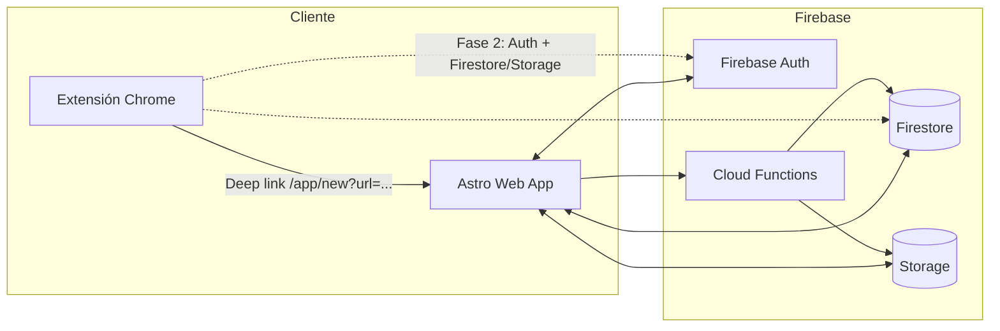
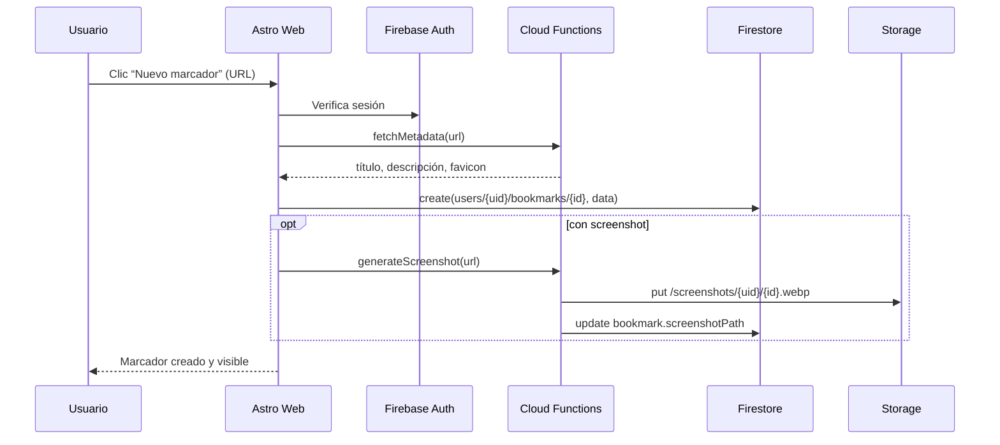

# Diagramas (Mermaid)

## Componentes

```mermaid
flowchart LR
  subgraph Client[Cliente]
    Astro[Astro Web App]
    Ext[Extensión Chrome]
  end

  subgraph Firebase
    Auth[Firebase Auth]
    FS[(Firestore)]
    ST[(Storage)]
    CF[Cloud Functions]
  end

  Astro <--> Auth
  Astro <--> FS
  Astro <--> ST
  Astro --> CF
  Ext -->|Deep link /app/new?url=...| Astro
  Ext -.->|Fase 2: Auth + Firestore/Storage| Auth
  Ext -.-> FS
  CF --> FS
  CF --> ST
```

## Guardar marcador (webapp)

```mermaid
sequenceDiagram
  participant U as Usuario
  participant A as Astro Web
  participant AU as Firebase Auth
  participant CF as Cloud Functions
  participant FS as Firestore
  participant ST as Storage

  U->>A: Clic “Nuevo marcador” (URL)
  A->>AU: Verifica sesión
  A->>CF: fetchMetadata(url)
  CF-->>A: título, descripción, favicon
  A->>FS: create(users/{uid}/bookmarks/{id}, data)
  opt con screenshot
    A->>CF: generateScreenshot(url)
    CF->>ST: put /screenshots/{uid}/{id}.webp
    CF->>FS: update bookmark.screenshotPath
  end
  A-->>U: Marcador creado y visible
```
